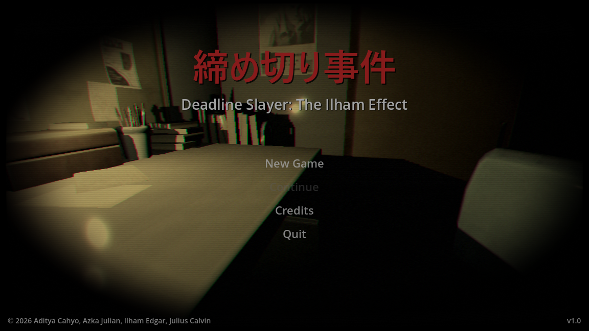
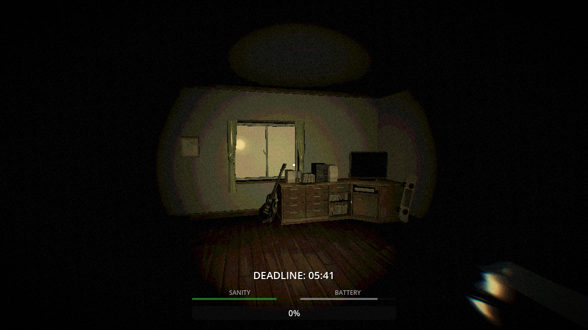
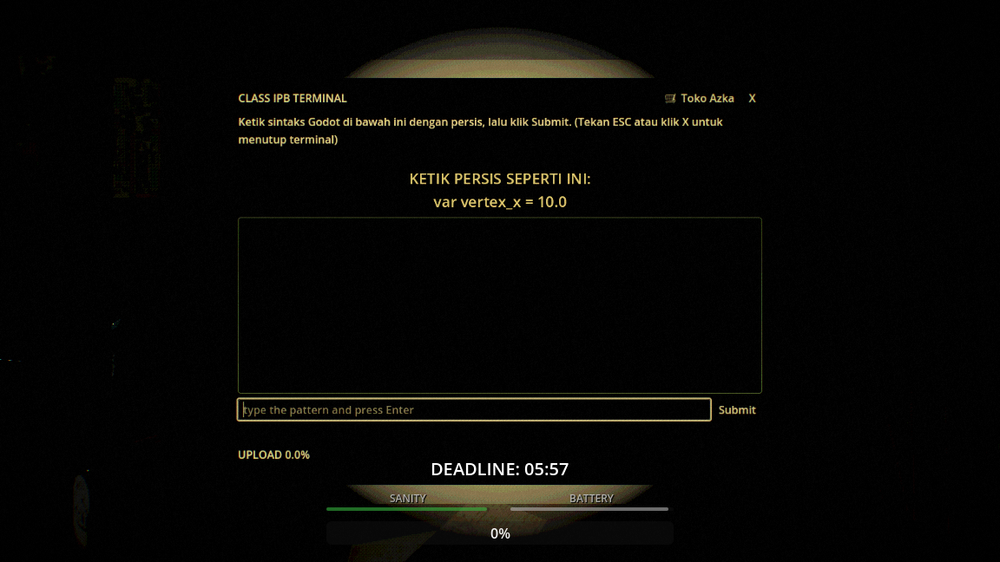
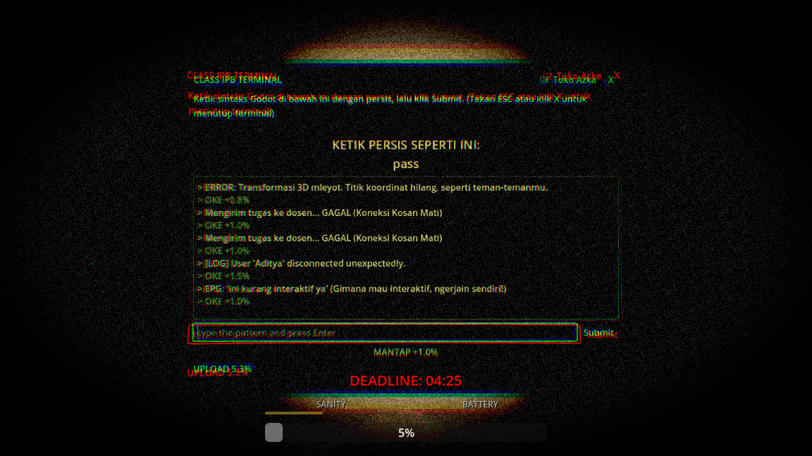

# Deadline Slayer: The Ilham Effect

## 📖 Tentang Game (About)

**Deadline Slayer: The Ilham Effect** adalah game horor *survival* di mana pemain berperan sebagai mahasiswa/programmer yang dikejar tenggat waktu (deadline). Pemain harus menyelesaikan tugas coding sambil menjaga tingkat kewarasan (*sanity*) dan daya baterai, serta menghindari gangguan gaib ("Specter") yang terus menghantui seiring bertambahnya progres.

---

## 🎮 Cara Bermain & Kontrol

**Tujuan Utama:** Selesaikan target *coding* hingga progress mencapai 100% sebelum waktu habis (*deadline*) atau *sanity* (kewarasan) mencapai angka 0.

### Kontrol Dasar
- **W, A, S, D**: Bergerak
- **Mouse**: Menggerakkan kamera (melihat sekitar)
- **Spasi (Space)**: Melompat
- **E**: Interaksi (Berinteraksi dengan Terminal Coding, Kopi, Baterai, dll.)
- **F**: Menyalakan / Mematikan Senter (*Flashlight*)
- **P**: Jeda (*Pause*) / Melanjutkan Game
- **Esc**: Keluar dari Terminal Coding atau menampilkan kursor mouse

### Mekanik Game

- **Coding Terminal**: Dekati terminal, tekan `E`, dan ketikkan sintaks kode persis seperti yang ditampilkan di layar untuk menambah progres.
- **Sanity (Kewarasan)**: Terus berkurang seiring berjalannya waktu. Cari item **Kopi** untuk memulihkannya.
- **Battery**: Senter akan menguras baterai. Cari item **Battery** untuk mengisi daya kembali.
- **Specter / Jumpscares**: Semakin tinggi progres coding Anda (25%, 50%, 75%, 99%), semakin intens gangguan yang akan Anda alami.

---

## 🛠️ Menu Debug (Developer Tools)

Game ini menyertakan menu debug untuk keperluan testing selama masa pengembangan.
- **F3 (atau F4 tergantung konfigurasi)**: Menampilkan/Menyembunyikan UI Debug.

**Fungsi dalam Debug Menu:**
- **Start 5m / 10s**: Memulai timer test global.
- **Stop / Reset**: Menghentikan atau mereset timer.
- **Finish Now**: Langsung memicu event timer selesai.
- **Progress +10**: Menambah 10% progress coding instan.
- **Lose Sanity**: Mengurangi 25 sanity secara instan.

---

## ⚙️ Dokumentasi Teknis

### Arsitektur Sistem
Proyek ini dibangun menggunakan **Godot Engine 4.5** dengan arsitektur berbasis *Autoloads* / *Singletons* dan pola *Event-Driven*:
- `EventBus`: Sentral komunikasi sinyal global antar komponen.
- `GameManager`: Mengelola alur game utama (kondisi Menang/Kalah, waktu deadline).
- `ProgressSystem` & `EventTrigger`: Melacak progres pemain dan memicu event horor secara spesifik berdasarkan persentase (*threshold*).

### CI/CD dan Deployment (Vercel & Windows)
Proyek ini telah dikonfigurasi dengan *Continuous Integration & Continuous Deployment* (CI/CD) menggunakan **GitHub Actions**.

1. **Vercel Web Deployment**: Setiap kali ada *push* atau *merge* ke branch `main`, GitHub Actions akan otomatis mengekspor game ini dalam format Web (HTML5) menggunakan `barichello/godot-ci:4.5` dan langsung men-deploy-nya ke server **Vercel**.
2. **Windows Desktop Release**: Selain Web, workflow ini juga akan membuat executable untuk **Windows Desktop**. Hasil *build* `.exe` dapat langsung diunduh melalui tab **Actions -> Artifacts** di GitHub.
3. *(Opsional)* **Mac OS**: Dukungan untuk Mac dapat ditambahkan melalui menu `Project -> Export` di Godot.

### Cara Setup di Lokal
1. Pastikan Anda telah menginstal **Godot Engine versi 4.5**.
2. Lakukan clone repository ini ke komputer Anda.
3. Buka Godot Engine, pilih `Import`, dan cari file `project.godot` di dalam folder hasil clone.
4. Tekan tombol **F5** (atau ikon Play di pojok kanan atas) untuk mencoba menjalankan game.
